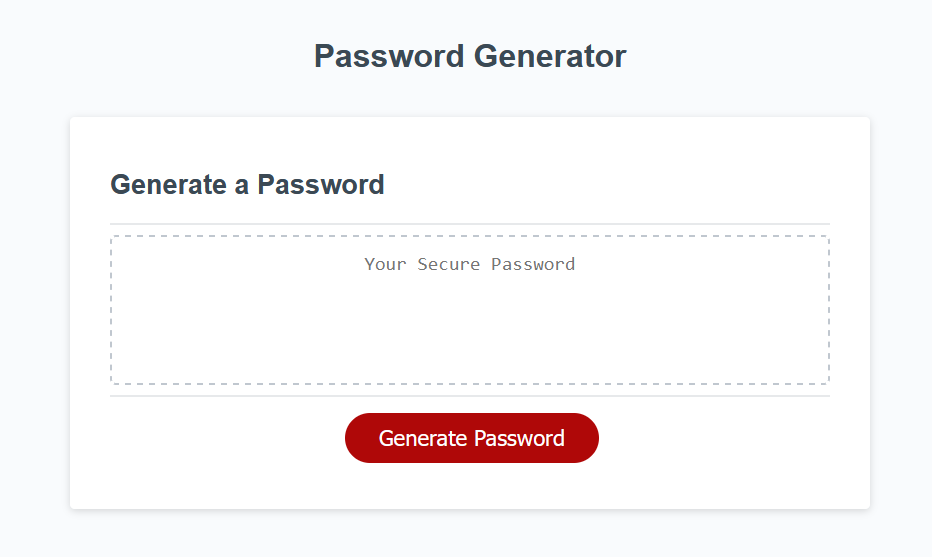

# password-generator
Simple javascript password generator.

## Description
A simple password generator using javascript. User input is collected through the javascript prompt and confirm methods, kind of gross, but functional. Input is validated and users can abort generation at two stages in the process. 

## Installation

NA

## Usage

The end result can be viewed [here.](https://jaredboehm.github.io/password-generator/)

## License

NA